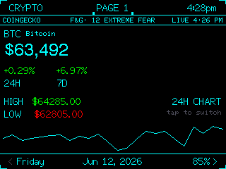
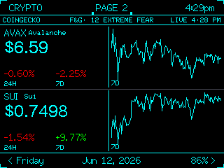
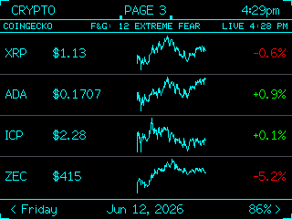
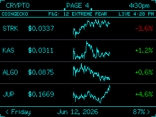
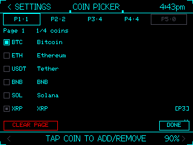
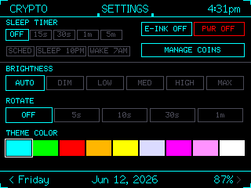

# xXCYD-Crypto-TrackerXx

Real-time cryptocurrency tracker for the ESP32-32E (1-USB) and 2USB CYD (Cheap Yellow Display) — live prices, 24H/7D sparkline charts, Fear & Greed index, multi-page coin layout, and intelligent power management.

[](https://www.patreon.com/c/xXQuantumSmokeXx)

## Screenshots

| Page 1 | Page 2 | Page 3 |
|--------|--------|--------|
|  |  |  |

| Page 4 | Coin Picker | Settings |
|--------|-------------|----------|
|  |  |  |

## Features

**Crypto Pages (1-5):**
- Up to 5 configurable pages, each holding 1-4 coins
- **1-coin view:** large price, 24H/7D change percentages with themed labels, HIGH/LOW values, inline sparkline graph with tap-to-switch between 24H and 7D timeframes
- **2-coin view:** side-by-side layout with sparklines and percentage changes
- **3-4 coin view:** compact rows with mini sparklines
- Comma-formatted USD prices across all layouts
- Auto-rotate between enabled pages (configurable interval in Settings)
- Disabled pages auto-skipped in navigation

**Live Data:**
- CoinGecko API integration — fetches prices, 24H/7D changes, high/low, and 7-day sparkline data
- Fear & Greed Index displayed in status bar
- SD card caching with configurable TTL — survives reboots offline
- Background fetch every 60 seconds via FreeRTOS worker on Core 0
- Retry logic on boot — splash screen holds until data loads (up to 4 attempts)
- LIVE / CACHED indicator with last sync timestamp

**Coin Picker:**
- 50 built-in coins (see list below)
- Custom coin support via `custom_coins.txt` on SD card — add any CoinGecko-listed token
- Page management: enable/disable pages, clear pages, move coins between pages
- Visual indicators for coins assigned to other pages
- Gapless page tabs for easy touch navigation

**Power Management:**
- Auto-brightness via LDR light sensor
- Sleep timer — display off after configurable idle time, tap to wake
- Schedule-based sleep — set sleep/wake hours, display auto-off during window
- E-Ink mode — white background for outdoor/glare readability

**Display & UI:**
- 9 theme accent colors (CYAN, GREEN, RED, ORANGE, YELLOW, GRAY, PURPLE, PINK, WHITE) saved to NVS
- Themed top bar with live clock and screen label
- Themed bottom bar with date and battery percentage
- Status bar with data source, Fear & Greed, and LIVE/CACHED indicator
- Abstract faceted crypto-core splash logo
- Touch calibration with rotation cycling (2USB)
- Display orientation auto-detection (2USB MADCTL)

**Screenshot Capture:**
- Serial screenshot via RGB332 protocol — send `S` at 115200 baud
- Compatible with included `screenshot.py` — auto-detects COM port, saves BMP to `ScreenShots/`
- Interactive mode (double-click) or command line: `python screenshot.py COM10 0`

## Default Coins (Top 50)

BTC, ETH, USDT, BNB, SOL, XRP, DOGE, ADA, TRX, AVAX, SHIB, **SUI**, WBTC, DOT, LINK, BCH, NEAR, UNI, LTC, MATIC, ICP, XLM, XMR, ATOM, CRO, FIL, VET, ARB, OP, HBAR, GRT, INJ, RNDR, **STRK**, IMX, MKR, RUNE, ALGO, AAVE, **KAS**, QNT, FLOW, EGLD, FTM, **COQ**, **ZEC**, **JUP**, **BONK**, **TIA**, XTZ

## Custom Coins

Drop `custom_coins.txt` on the SD card root with one CoinGecko ID per line:

```
# Format: coin_id or coin_id,SYMBOL
pepe,PEPE
fetch-ai,FET
```

Up to 10 custom coins. Appear below the 50 built-in coins in the Coin Picker. [Find CoinGecko IDs](https://www.coingecko.com/en/coins/list).

## Setup

| Board | Firmware File |
|-------|--------------|
| **ESP32-32E** (1-USB) | `CYD-Crypto-Tracker-1usb.bin` |
| **2USB** (all variants) | `CYD-Crypto-Tracker-2usb.bin` |

**Direct flash:**
```bash
esptool.py --chip esp32 write_flash 0x0 CYD-Crypto-Tracker-1usb.bin
esptool.py --chip esp32 write_flash 0x0 CYD-Crypto-Tracker-2usb.bin
```

**Via M5Launcher:** copy the `.bin` file onto a micro SD card (FAT32), insert into your CYD, launch [M5Launcher](https://github.com/bmorcelli/M5Launcher), select the firmware, and flash.

**SD card files (place on root):**
- `wifi.txt` — WiFi credentials: line 1 = SSID, line 2 = password
- `custom_coins.txt` — optional custom CoinGecko IDs (one per line)
- `apikey.txt` — optional CoinGecko API key (single line, avoids anonymous rate limits)
- `cache/btc.json` — auto-generated price cache

## Serial Commands

- `0`–`5` — switch screens (0–4 = crypto pages, 5 = settings)
- `F` — force refresh crypto data
- `M` — cycle display rotation (2USB)
- `T` — cycle touch rotation (2USB)
- `R` — ready check
- `S` — screenshot capture (RGB332)

## Build

```bash
# 1-USB variant
pio run -e cyd_crypto

# 2-USB variant
pio run -e cyd_crypto_2usb
```

Requires PlatformIO with `espressif32@6.3.0` platform. The only build flag difference between variants is `-DCYD_USB_VERSION=1` vs `-DCYD_USB_VERSION=2`.

## Project Structure

```
src/
  main.cpp                       — app loop, WiFi, fetch worker, splash art
  config/
    config.h                     — pins, geometry, constants
    secrets.h                    — API keys (gitignored)
    nvs_config.h/.cpp            — Preferences/NVS wrapper
  modules/
    wifi_config.h/.cpp           — SD-based WiFi bootstrapping
    time_sync.h/.cpp             — NTP time sync
    brightness.h/.cpp            — LDR auto-brightness, battery %
    crypto.h/.cpp                — CoinGecko API, Fear & Greed, data model
  ui/
    theme.h                      — colors, fonts, invert mode
    theme_color.h/.cpp           — runtime theme switching (9 colors)
    widgets.h/.cpp               — topbar, bottombar, statusbar, pct chip
    screens/
      screen_crypto.h/.cpp       — main coin page display (1-4 coins)
      screen_detail.h/.cpp       — single-coin detail + graph tabs
      screen_settings.h/.cpp     — settings (sleep, rotate, theme, coins)
      screen_coinpicker.h/.cpp   — top-50 coin picker + custom coins
  touch/
    touch.h/.cpp                 — XPT2046 resistive touch (swipe + tap)
screenshot.py                    — PC-side screenshot capture script
sd_card/
    wifi.txt                     — example WiFi config
    custom_coins.txt             — example custom coins
```

## Credits

**Check out my other projects:**
- [xXCYD-PokerXx](https://github.com/xXQuantumSmokeXx/xXCYD-PokerXx) — classic Joker Poker + Texas Hold'em for CYD
- [xXCYD-Weather-StationXx](https://github.com/xXQuantumSmokeXx/xXCYD-Weather-StationXx) — tactical weather & monitoring station

Built by xXQuantum-SmokeXx, with development assistance from Codex & Claude Code.
